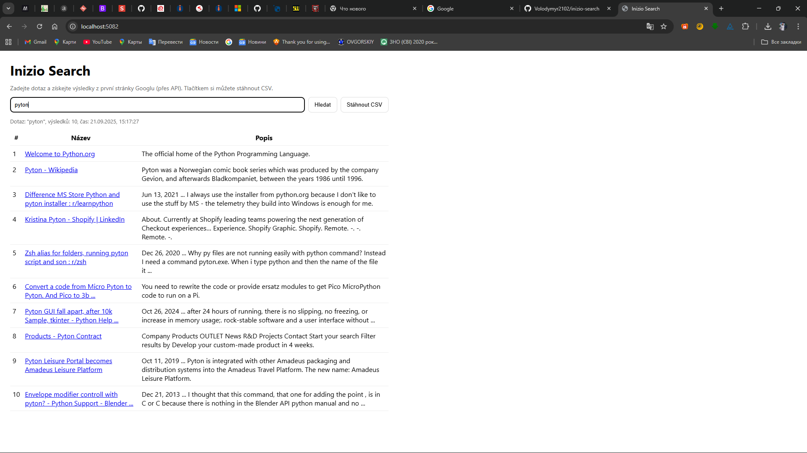

📘 Inizio Search
> Webová aplikace pro testovací úkol (🇨🇿 čeština níže, 🇬🇧 English below)

---

## 🇨🇿 Česká verze
Jednoduchá webová aplikace, která umožňuje zadat vyhledávací dotaz a získat výsledky z první stránky Google (přes Google Custom Search API).

✨ Funkce

🔎 Vyhledávání v Google (název, odkaz, popis)

📄 Výsledky dostupné ve formátu JSON nebo CSV

🌐 Frontend v češtině (HTML + JS)

✅ Unit testy (xUnit)

📦 Dockerfile pro snadné nasazení (Render, Railway, apod.)

🚀 Demo

Aplikace běží online na Render:
👉 https://inizio-search-1-n6he.onrender.com

📷 Screenshot
```bash

```

🧪 Testy

Spuštění testů:
```bash
dotnet test inizio-search.sln
```

Výsledek: všechny testy procházejí ✅

⚙️ Lokální spuštění

Nastav proměnné prostředí:
```bash
export GOOGLE_API_KEY=tvuj_api_klic
export GOOGLE_CSE_ID=tvuj_cx
```

Spusť aplikaci:
```bash
cd inizio-search/inizio-search
dotnet run
```


Otevři v prohlížeči:
👉 http://localhost:5082

🐳 Docker

Build a spuštění kontejneru:
```bash
docker build -t inizio-search .
docker run -p 8080:8080 -e GOOGLE_API_KEY=xxx -e GOOGLE_CSE_ID=xxx inizio-search
```

## EN English verze
A simple web application that allows you to enter a search query and fetch results from the first page of Google (via Google Custom Search API).

✨ Features

🔎 Google search (title, link, description)

📄 Results available in JSON or CSV

🌐 Frontend in Czech (HTML + JS)

✅ Unit tests (xUnit)

📦 Dockerfile for easy deployment (Render, Railway, etc.)

🚀 Demo

The app is running online on Render:
👉 https://inizio-search-1-n6he.onrender.com

📷 Screenshot

```bash

```

🧪 Tests

Run tests:
```bash
dotnet test inizio-search.sln
```

Result: all tests passed ✅

⚙️ Local run

Set environment variables:
```bash
export GOOGLE_API_KEY=your_api_key
export GOOGLE_CSE_ID=your_cx
```

Run the app:
```bash
cd inizio-search/inizio-search
dotnet run
```

Open in browser:
👉 http://localhost:5082

🐳 Docker

Build and run container:
```bash
docker build -t inizio-search .
docker run -p 8080:8080 -e GOOGLE_API_KEY=xxx -e GOOGLE_CSE_ID=xxx inizio-search
```
📌 Autor

Bc. Volodymyr Dukhno — junior C#.NET developer